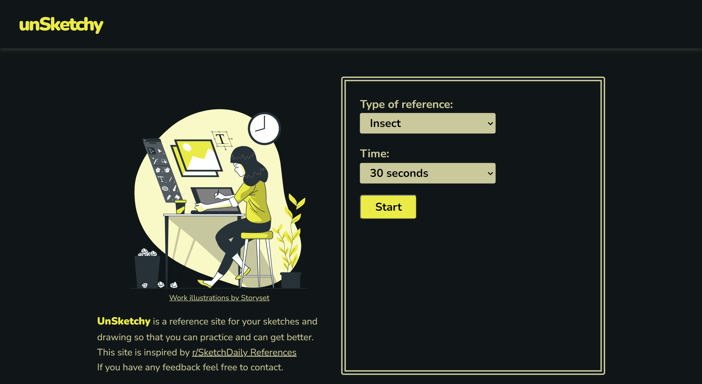

**It's a work in progress :>:P**
# unSketchy (Sketch Reference)

A reference site/web App for sketching.
*need to add content here*

## Table of contents
- [overview](#overview)
  - [Description](#Description)
  - [Screenshot](#Screenshot)
  - [Links](#Links)
- [My process](#my-process)
  - [Built With](#built-with)
  - [What I learned](#what-i-learned)
  - [Continued development](#continued-development)
  - [Useful resources](#useful-resources)
- [How to Contribute](#how-to-Contribute)
- [To run local](#to-run-local)
- [Author](#Author)
- [Acknowledgments](#Acknowledgments)  

## Overview

A unSketchy is a reference site to practice sketching and drawing.
This project is built using reactJs and use unplash API to fetch images.

[see the live demo here](https://unsketchy.vercel.app/)

## My Process

### useful resources
- [reactjs](https://reactjs.org/)
  - [Bob Ziroll's react course](https://scrimba.com/learn/learnreact)
- [unplash Api Documentation](https://unsplash.com/documentation)
- [font awesome](https://fontawesome.com/)
- [Google Fonts](https://fonts.google.com/)
- [storyset](https://storyset.com/)

## how to contribute

## to run local

## Author

## Acknowledgments
This site is inspired by [r/SketchDaily](http://reference.sketchdaily.net/) References.
